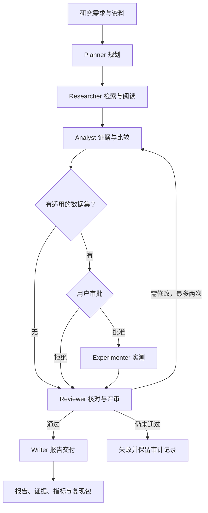

# ResearchOps · 研流

面向 AI 团队的**自动技术调研与检索基准验证工作台**。将一个研究需求交给 6 个专职 agent，交付可追溯的证据、方法比较、真实计算的实验指标和研究报告。

业务切入点：为正在建设企业知识库 / RAG 产品的小团队提供技术选型与评估服务。用户输入研究目标，导入技术资料和查询—候选文档 CSV；系统完成调研、提出比较方案，经用户批准执行基准，再通过评审形成交付。

这是一套可运行的完整垂直工作流。通用领域可以做证据调研；内置实验能力聚焦 **overlap / TF-IDF / BM25 固定候选检索评估**。它不宣称自动完成任意论文复现、自动产生科研创新或完成 GPU 模型训练。

## 一键启动

只需 **Python 3.10+**，核心程序、前端和测试无需安装第三方依赖。

```bash
git clone https://github.com/DwightEd/agent.git
cd agent
python -m backend.server
```

打开 **http://127.0.0.1:8000**，首次访问创建管理员（无默认密码）。然后点击 **“体验完整示例” → “查看并审批” → “批准并执行实验”**。任务完成后可以查看证据图谱、方法比较、指标与报告，导出 ZIP。

Linux/macOS 也可运行：

```bash
bash start.sh
```

不打开浏览器也可以验证完整闭环：

```bash
python scripts/demo.py
# 输出：data/demo-output/report.md、benchmark.json、metrics.csv 等
python -m unittest discover -v
```

`scripts/demo.py` 使用独立临时数据库，并显式批准随仓库附带的合成数据实验，不影响应用账户和项目。

## 两种运行模式

| 模式 | 决策方式 | 实际执行的内容 | 用途 |
|---|---|---|---|
| 演示模式 | 明确标记的确定性策略，不调用 LLM | 数据库、资料读取、工具调用、审批、CPU 实验、评审返工、文件导出 | 零密钥体验、离线验收 |
| 真实模式 | 兼容工具调用的模型，自主选择工具和参数、多轮读取观察、修正输出 | arXiv / 导入资料检索、证据分析、工具实验、模型评审与报告 | 实际研究任务 |

演示资料是原创说明，示例 CSV 是合成数据，界面和报告均明确标记。演示评审首轮固定要求一次返工，用于展示并验证反馈回路。演示中的指标是真实计算的，但不能当作生产业务或学术论文的效果结论。

### 接入模型

```bash
export LLM_API_KEY="你的模型服务密钥"
export LLM_BASE_URL="https://api.openai.com/v1"
export LLM_MODEL="你的模型名称"
python -m backend.server
```

Windows PowerShell：

```powershell
$env:LLM_API_KEY="你的模型服务密钥"
$env:LLM_BASE_URL="https://api.openai.com/v1"
$env:LLM_MODEL="你的模型名称"
python -m backend.server
```

模型必须支持 `/chat/completions`、`tools` / `tool_calls` 和 JSON 文本输出。也可在“工作台设置”中配置兼容服务，例如本地 `http://127.0.0.1:11434/v1`；本地服务可不设密钥。具体模型名由所用服务决定，预填值不是可用性保证。

密钥只从服务端环境读取，不存数据库、不发送到浏览器。界面保存过配置后，数据库中的配置优先于 Base URL / 模型环境变量。设置变更只影响新任务，已有任务保留配置快照。`python` 方式**不会自动加载 `.env`**；Docker Compose 会加载。

创建项目后可导入真实资料与数据，在“启动研究”中选择“真实模型 agent”。资料原文会作为上下文发送给你配置的模型服务。

## 已实现功能

| 模块 | 功能 |
|---|---|
| 账户 | 首次管理员初始化、密码哈希、Cookie 会话、登录退出、个人名称、管理员添加成员、可选注册 |
| 项目 | 创建、编辑、归档、恢复、删除；成员项目隔离 |
| 资料 | 文本 / Markdown / PDF 导入、关键词搜索、原文查看、来源链接、去重、删除、任务级快照 |
| 检索 | agent 搜索导入资料；真实模式调用 arXiv Atom API，默认仅摘要，外部来源带标识 |
| Agent | 6 个独立角色契约、按角色工具权限、多轮工具调用、结构校验与修正、评审返工 |
| 任务 | SQLite 队列、阶段检查点、取消、失败重试、启动恢复、每项目一个活动任务 |
| 审批 | 展示 CSV 名称、SHA-256、算法、K 与执行范围；批准执行 / 拒绝后继续证据报告 |
| 实验 | overlap / TF-IDF / BM25；Recall@K、全候选 MRR、nDCG@K、查询 bootstrap 区间、逐查询排序 |
| 可视化 | 项目概览、7 日任务活动、角色执行状态、可展开工具日志、可点击证据图谱、指标条形图、比较表 |
| 交付 | Markdown 报告、JSON 证据、CSV 指标、实验 JSON、数据 CSV、manifest 与 ZIP 导出 |
| 资料问答 | 关键词定位相关原文；明确标记未调用模型，复杂综合通过研究任务完成 |
| 定期研究 | 按 1–720 小时周期创建调研任务，避免重叠；不自动选择实验数据集 |
| 配置与运维 | 模型服务配置、调用上限、token 用量、健康接口、数据库备份、Docker、CI |

PDF 为可选扩展：

```bash
pip install -r requirements-pdf.txt
```

PDF 限制：1.4 MB、80 页，最多导入前 60,000 字符；不包含 OCR，扫描件需先提取文字。核心文本导入无需此依赖。

## Agent 流程



角色不是只换名字的固定提示词串联。真实模式下，每个角色可在最多 8 轮中选择允许的工具、读取结果、继续检索或修正输出。协调器管理阶段状态和人类审批；Reviewer 的结论可将任务退回 Analyst。详细契约与持久化语义见 [架构文档](docs/architecture.md)。

## 数据集格式

```csv
query_id,query,document,relevant
q1,alpha,alpha information,1
q1,alpha,unrelated document,0
q2,beta,beta information,1
q2,beta,unrelated document,0
```

每个 query 是一个独立固定候选组，相关性标签只用于评估，不参与参数训练。至少 2 个查询，每个查询至少 2 个不同候选且有 1 个相关候选；同一 `query_id` 必须对应同一查询。并列打分按文档哈希决定，避免输入排序影响结果。详情见 [实验协议](docs/experiments.md)。

## 项目结构

```text
backend/
  server.py          HTTP、鉴权、静态前端、单进程锁
  service.py         业务 API、项目/资料/任务/导出
  db.py              SQLite schema、事务、备份
  auth.py            scrypt 密码与会话
  engine.py          持久队列、检查点、审批、评审回路、调度
  agents.py          角色契约、工具决策循环、演示策略
  research_tools.py  arXiv、资料工具、引用核对、基准工具
  providers.py       OpenAI 兼容 HTTP / 工具协议
  benchmark.py       可复现检索算法和指标
  reports.py         报告及复现产物
frontend/            无构建步骤的模块化 JavaScript、CSS、SVG
examples/            原创演示资料与合成检索数据
tests/               HTTP、完整工作流、指标、真实模式协议测试
scripts/             独立验收与在线备份
docs/                产品、架构、实验、API、部署与验收说明
```

前端与 API 同源。SQLite 存账户、项目、来源、数据集、任务、阶段、事件、审批、交付物、消息、调度与设置。默认文件为 `data/researchops.db`，重启后保留全部记录。

## 部署与验证范围

```bash
cp .env.example .env
# 编辑 .env，至少设置随机 BOOTSTRAP_TOKEN
docker compose up --build
```

本地一键运行与自动化测试已验证；Docker 构建、浏览器视觉验收、外部付费模型和 arXiv 实时联网需在你的环境中进一步验证。当前环境的浏览器连接未成功，**不将 JavaScript 语法检查等同于浏览器验收**。

已通过 13 项测试：完整审批、拒绝后继续、评审返工、失败重试、重启恢复、资料快照、账户隔离、取消、调度不重叠、指标基准、HTTP 鉴权、真实模式 HTTP 工具协议、调用预算。模型协议测试使用本地 HTTP 测试服务，未声称调用真实商业模型。

更多文档：[产品与商业闭环](docs/product.md) · [架构](docs/architecture.md) · [API](docs/api.md) · [部署与运维](docs/operations.md) · [验收记录](docs/verification.md)。
