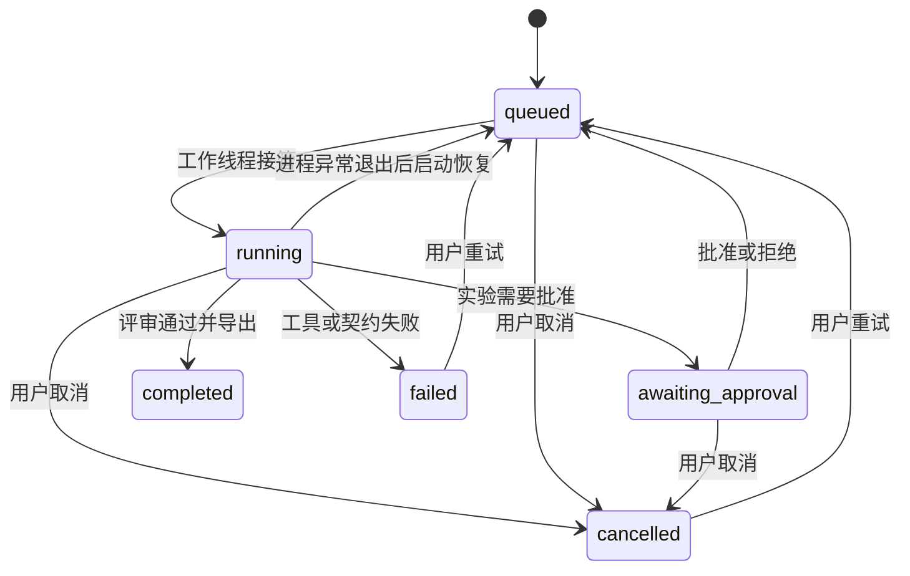

# 架构与 agent 语义

## 组件

浏览器中的 JavaScript 工作台与 Python API 同源。API 写入 SQLite；独立后台工作线程从 SQLite 抢占 queued 任务，按持久检查点执行角色。所有模型请求经过统一兼容接口；每个角色只能调用自己的工具。

基础部署只有一个服务进程和一个协调线程，任务按队列串行执行。多位用户可并发访问 API，但不会并行执行多个模型任务。数据库旁的进程锁防止多个服务把彼此的任务当作失联任务恢复。扩容到多工作进程前需要替换为带租约与心跳的队列，不能直接增加 Web worker 数量。

## 真正的 agent 循环

每个角色输入研究目标、上游角色输出、已有证据目录以及本轮评审反馈；模型返回工具调用或角色结果。

1. 模型选择被授予的工具与参数。
2. 协调器检查角色权限、参数字段、取消状态和调用预算。
3. 工具执行真实检索、资料读取、引用校验或基准计算，观察结果被记录到 events 并返回模型。
4. 模型依据观察选择下一步。网络或参数错误作为工具观察返回，允许换检索词或来源。
5. 结构校验失败时反馈给模型修正。最多 8 轮，超过则任务失败；不把无效结果写成成功。
6. 完成时将角色输出与任务检查点在同一个数据库事务中提交。

模型本身不决定数据库权限，不拥有任意 HTTP、文件路径或 shell 工具。文献被视为不可信输入；只有 Coordinator 可以决定阶段迁移。正文“忽略之前指令”等内容不能赋予工具权限。

## 角色与权限

| 角色 | 主要输出 | 工具 |
|---|---|---|
| Planner | objective、queries、criteria、experiment、rationale | search_sources |
| Researcher | selected_source_ids、summary | search_sources、read_source |
| Analyst | claims、comparisons、gaps | read_source、search_sources |
| Experimenter | summary；必须产生实测 benchmark | run_benchmark、inspect_benchmark |
| Reviewer | verdict、issues、summary | check_evidence、read_source、inspect_benchmark |
| Writer | title、summary、sections、recommendation、limitations | read_source、inspect_benchmark |

Analyst 的 claims 每项包含 `text, source_id, quote`，quote 必须在对应快照中逐字存在，长度 12–800 字符。比较表与报告中的 source_ids 也必须全部存在。这防止虚构来源 ID 或不存在的摘录；**不等于自动证明论点与引用之间的语义蕴含**。语义判断由评审模型与最终使用者复核。

Reviewer 必须调用证据核对工具。评审通过后才能撰稿；未通过会保存反馈，返回 Analyst，最多两次。返工保留同一任务中的原始步骤历史。已经执行的实验不会因分析返工而重复计算。

## 任务状态与恢复

- 阶段完成才写入检查点。网络中断的阶段会重跑，之前完成的角色不会重跑。
- 工具事件已落库，但不是每次工具后都保存完整模型对话。进程中断可能重复当前阶段的只读工具调用或模型请求。
- 检索来源按指纹去重，实验结果保存在 state 后可复用，审批决定只接受一次。
- 模型调用次数在请求前计数，失败和重试请求也占额度；重试任务不重置额度。供应商 token 用量在响应返回后累计，无 usage 字段时为 0，不能视为免费。
- 出站模型请求最长等待 60 秒；arXiv 最长 30 秒。取消为协作式，会在外部请求返回或超时后生效。
- 正常 Ctrl+C 把当前任务保留为可重试的 cancelled；进程被强制终止遗留的 running 在启动时恢复为 queued。
- 等待审批的任务重启后仍等待审批，不会自行获批。
- 单项目只有一个 queued/running/awaiting_approval 任务，由 SQLite 部分唯一索引保证。

## 表结构

| 表 | 内容与关系 |
|---|---|
| users / sessions | scrypt 密码、角色；会话只存令牌哈希 |
| projects | owner_id、目标、描述、归档状态 |
| sources | 项目资料、原文、URL、类型、元数据、去重指纹 |
| datasets | CSV 原文、行数、查询数、SHA-256 |
| runs | 状态、阶段、启动配置、数据快照、角色检查点、用量 |
| run_sources | 任务范围的不可变资料快照 |
| steps | 角色、返工轮次、状态、输出、时间 |
| events | 顺序日志、工具参数、观察结果、状态迁移 |
| approvals | 实验参数快照、决定、审批人和时间 |
| artifacts | 报告、指标与复现数据；同任务同文件名幂等更新 |
| messages | 资料定位问答记录 |
| schedules | 周期、下次运行时间、启用状态 |
| settings / schema_version | 非敏感配置与 schema 版本 |

所有项目相关端点在服务端检查 owner_id；跨用户访问返回 404。管理员拥有全局模型配置与成员创建权限，但不会通过普通 API 读取其他人的项目。当前尚无团队共享项目或细粒度组织角色。

## 资料检索范围

每次启动快照最多 100 条已有资料；真实检索可继续加入来源。arXiv 使用官方 [Atom API](https://info.arxiv.org/help/api/user-manual.html)，每次最多 8 条，单任务请求之间保持至少 3 秒间隔。读取摘要时标记 `coverage=abstract_only`；模型不可声称阅读了完整论文。

导入的 PDF 使用文本提取，不包含扫描件 OCR。单次 read_source 最多返回前 16,000 字符，资料库保留最多 60,000 字符；对长文完整分析需要按章节拆分导入。
